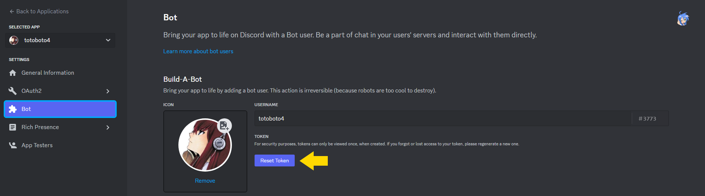
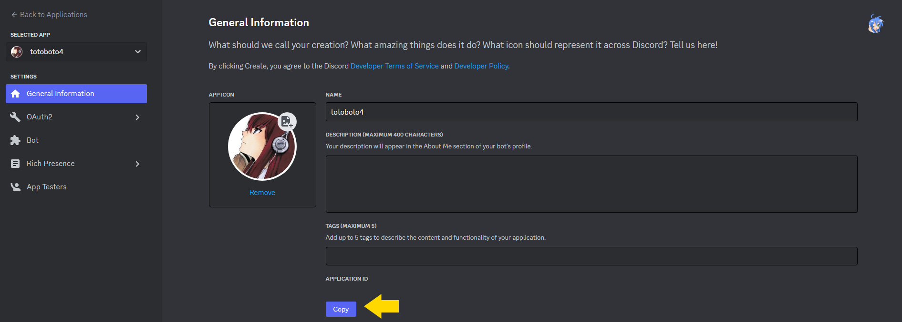

# totoboto4

Ce bot fonctionne avec des modules créés à l'aide de mon [SDK](https://github.com/totobono4/totoboto4-module-SDK)

Pour tester, vous pouvez utiliser mon [exemple](https://github.com/totobono4/totoboto4-module-example).

## Comment l'utiliser ?

Commencez par cloner ce projet et exécutez `npm i` à la racine:
```shell
git clone https://github.com/totobono4/totoboto4
npm i
```

### Lier votre Discord App

Si vous n'avez pas d'application, rendez-vous sur le [Portail Développeur](https://discord.com/developers/applications) de Discord dans la section "Applications", puis créez en une.

Vous pourrez récupérer votre Token et Client Id comme suit:




Renseignez les variables d'environnement nécessaires récupérées précédemment dans un `.env` à la racine du projet, comme ci-dessous:

```env
CANARY_TOKEN=<Token Canary>
CANARY_ID=<Id Canary>

RELEASE_TOKEN=<Token Release>
RELEASE_ID=<Id Release>
```

Le mode CANARY est un mode de développement, il permet de développer sur un deuxième bot sans avoir besoin d'éteindre le premier, si vous n'en trouvez pas l'utilité, ne renseignez pas les valeurs CANARY.

### Installer un module

Pour installer un module, commencez par cloner le dépot de votre module dans le dossier `totoboto4_modules`, et installez les dépendances npm. Par exemple:

```shell
git clone https://github.com/totobono4/totoboto4-module-example
npm i
```

Vous devrez ensuite activer votre module avec les commandes suivantes:

```shell
npm run modules-active release Example-module true
npm run modules-update release
```
en remplaçant "Example-Module" par le nom que vous avez donné à votre module dans son `module.js`.

il vous suffit ensuite de démarrer le bot:
```shell
npm start
```

### liste des scripts npm

Commande                | Utilité                            | Exemple
----------------------- | ---------------------------------- | -
modules-active          | Activer un module                  | `npm run modules-active Example-Module true`
modules-active-canary   | Activer un module canary           | `npm run modules-active-canary Example-Module true`
modules-clean           | Effacer les commandes              | `npm run modules-clean`
modules-clean-canary    | Effacer les commandes canary       | `npm run modules-clean-canary`
modules-register        | Enregistrer des commandes          | `npm run modules-register`
modules-register-canary | Enregistrer des commandes canary   | `npm run modules-register-canary`
modules-update          | Mettre à jour les commandes        | `npm run modules-update`
modules-update-canary   | Mettre à jour les commandes canary | `npm run modules-update-canary`
modules-show            | Voir les commandes                 | `npm run modules-show`
modules-show-canary     | Voir les commandes canary          | `npm run modules-show-canary`
