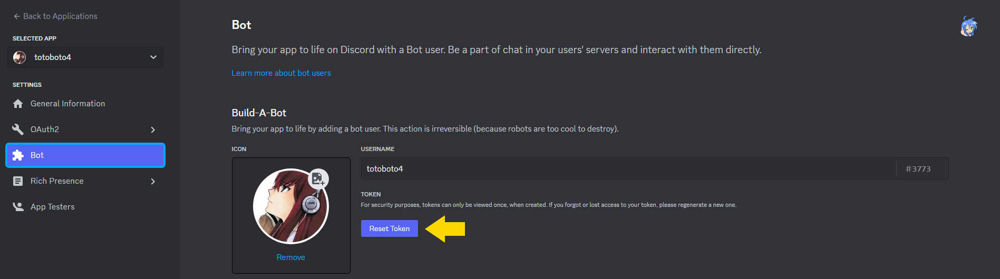
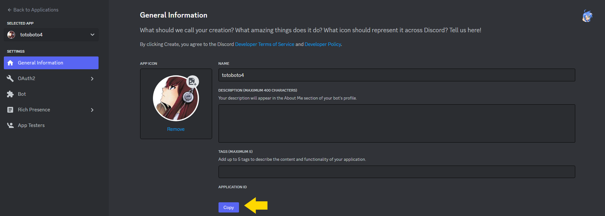

# totoboto4

🌏 [Documentation Française](README.fr.md)

This bot works with modules created thanks to my [SDK](https://github.com/totobono4/totoboto4-module-SDK)

For testing, feel free to use my [example](https://github.com/totobono4/totoboto4-module-example).

## How to use it ?

Before doing anything else, clone this project and execute `npm i` at root:
```shell
git clone https://github.com/totobono4/totoboto4
npm i
```

### Link your Discord App

If you don't have any application, go to the Discord's [Developper Portal](https://discord.com/developers/applications) in the "Applications" tab, and create one.

You'll be able to get your Token and Client Id:




Fill environments variables with theses values, in a `.env` at the root of the project, like this:

```env
CANARY_TOKEN=<Canary Token>
CANARY_ID=<Canary Id>

RELEASE_TOKEN=<Release Token>
RELEASE_ID=<Release Id>
```

The CANARY mode is a development mode, it allows you to use another bot so you can let the first one running, if that's useless for you, don't fill CANARY values.

### Install a module

For install a module, Starts to clone you module repo in the `totoboto4_modules` folder, for example:

```shell
git clone https://github.com/totobono4/totoboto4-module-example
```

And then, active your module like this:

```shell
npm run modules-active release Example-module true
npm run modules-update release
```
by replacing "Example-Module" By the name of your module in your `module.js`.

Finally start the bot:
```shell
npm start
```

### list of npm scripts

Commands                | Usage                    | Example
----------------------- | ------------------------ | -
modules-active          | Active a module          | `npm run modules-active Example-Module true`
modules-active-canary   | Active a canary module   | `npm run modules-active-canary Example-Module true`
modules-clean           | Delete commands          | `npm run modules-clean`
modules-clean-canary    | Delete canary commands   | `npm run modules-clean-canary`
modules-register        | Register commands        | `npm run modules-register`
modules-register-canary | Register canary commands | `npm run modules-register-canary`
modules-update          | Update commands          | `npm run modules-update`
modules-update-canary   | Update canary commands   | `npm run modules-update-canary`
modules-show            | Show commands            | `npm run modules-show`
modules-show-canary     | Show canary commands     | `npm run modules-show-canary`
